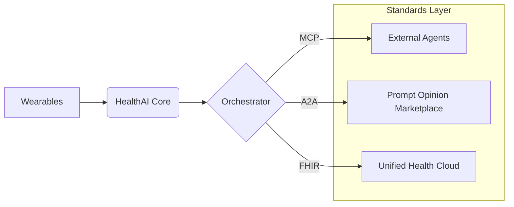

# HealthAI Orchestrator: Interoperable Wellness Intelligence

[](https://agents-assemble.devpost.com/)


## 📌 The "Endgame" of Personal Health Intelligence
HealthAI Orchestrator is a robust, standards-driven platform designed for the **Agents Assemble Hackathon**. We bridge the gap between fragmented biometric data and actionable clinical insights by implementing the **Model Context Protocol (MCP)** and **Agent-to-Agent (A2A)** standards.

Our mission is to convert raw "intelligence" from wearables into **interoperable FHIR resources** that can be consumed by any secondary clinical agent in the Prompt Opinion ecosystem.

---

## 🚀 Architectural Superpowers

### 1. MCP Tooling (Building the Hammer)
We expose a specialized MCP server that allows external agents to query normalized biometric data.
- **`get_fhir_observations`**: Real-time conversion of local wearable data into FHIR-compliant Observation resources (R4).
- **`analyze_longevity_risk`**: A high-performance computation tool that derives longevity scores from multi-modal trends.

### 2. A2A Interoperable Agents (Building the Superhero)
Our Orchestrator is not a silo. It is a **Full Agent** that supports:
- **SHARP Context Propagation**: Seamlessly passes patient session credentials and FHIR tokens across agent call chains.
- **COIN Standards**: Utilizes Conversational Interoperability to coordinate between specialized "Symptom", "Nutrition", and "Risk" sub-agents.

### 3. FHIR Data Lake
By mapping data to **LOINC** codes (e.g., Heart Rate `8867-4`, BMI `39156-5`), we ensure that our insights are ready for direct integration into EHR (Electronic Health Record) systems.

---

## 🛠 Key Features

- **Live Voice Copilot**: A low-latency generative voice interface for natural health queries.
- **Biometric Orchestration**: Multi-wearable sync (Apple, Google, Fitbit) with automated conflict resolution.
- **Developer Terminal**: A pro-grade CLI to inspect A2A logs and MCP tool execution in real-time.
- **Privacy-First**: Local-first indexing with secure session-based FHIR token handling.

---

## 📐 Interoperability Flow



---

## 🏗 Installation

1. **Clone & Setup**
   ```bash
   npm install
   ```

2. **Environment Configuration**
   - `GEMINI_API_KEY`: Powering the A2A reasoning engine.
   - `FHIR_BASE_URL` (Optional): Connect to external FHIR sandbox.

3. **Run Dev Environment**
   ```bash
   npm run dev
   ```

---

*Submitted for the "Agents Assemble: The Healthcare AI Endgame" Challenge.*
